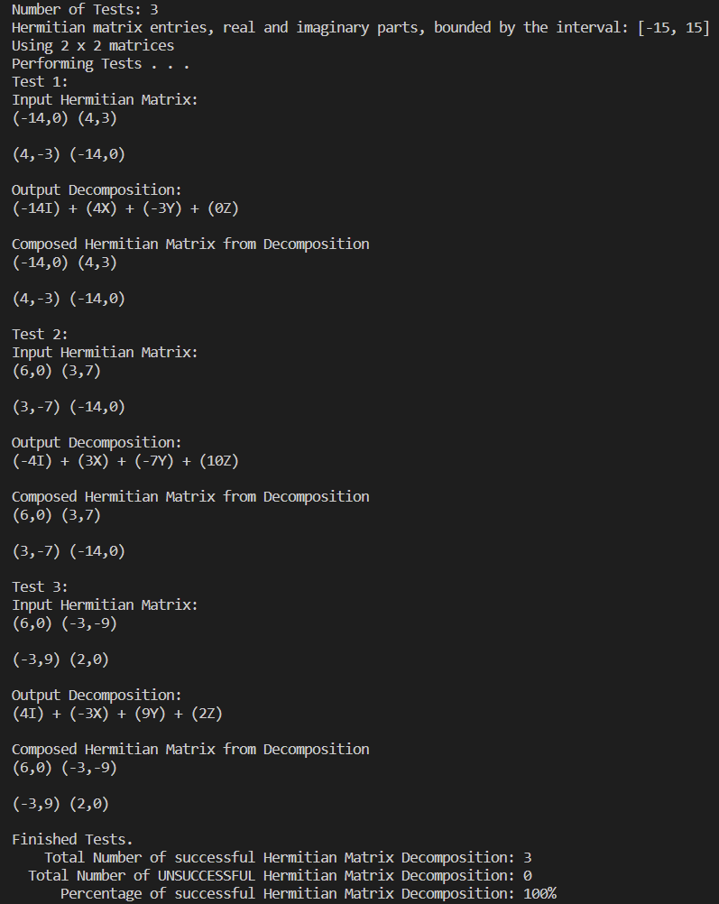
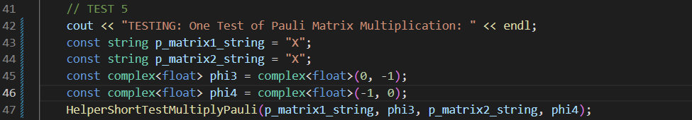
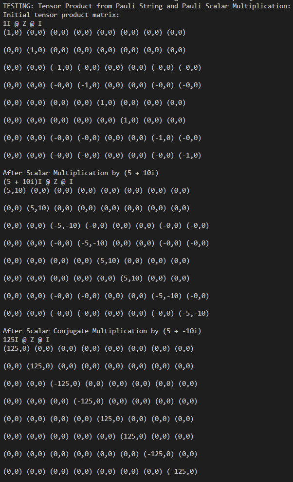

# Math Library

# Introduction
My name is Daniel Mendez, and I wrote all the code in this repository by myself. I wrote approximately 1400 lines of C++ source code. The repository currently only contains a package to manipulate Pauli matrices, but will be updated to contain more math libraries.

These three files contain the source code to manipulate pauli matrices:
1. Pauli_Matrix_Library.cc  
    - Contains all function and constructor definitions
2. Pauli_Matrix_Library.h 
    - Contains all function, constructor, and class specifications.
3. Test_PM_Library.cc
    - Contains Nine automated test cases to test functionality of my functions. Each test case has input parameters so that you may scale the test to your liking.

# Automated Tests
Here I will show 1 example for each of my nine test cases. However, please do not limit yourself to these specific test cases. You can modify the input parameters for each test case as you like in `Test_PM_Library.cc` 

Compilation command is: `g++  -g  -std=gnu++11  -Wall  -Werror  Test_PM_Library.cc  Pauli_Matrix_Library.cc -o  Test_PM_Library`

Run Command: `./Test_PM_Library`

**TEST 1: Create a Hermitian Matrix, then test if it is Hermitian.**

**Driver Code**

 

**Terminal Output**

 

**TEST 2: Decompose a 2 x 2 Hermitian Matrix into Pauli Matrices**

**Driver Code**

 

**Terminal Output**

 

**TEST 3: Multiply pauli matrix by a phase:**

**Driver Code**

 

**Terminal Output**

 

**TEST 4: P^2 = I, where P is a pauli matrix:**

**Driver Code**

 

**Terminal Output**

 

**TEST 5: One Test of Pauli Matrix Multiplication:**

**Driver Code**

 

**Terminal Output**

 

**TEST 6: Sixteen Tests of Pauli Matrix Multiplication**

**Driver Code**

 

**Terminal Output**

 

## Pauli Algebra Tests

**TEST 7: Tensor Product from Pauli String and Pauli Scalar Multiplication:**

**Driver Code**

 

**Terminal Output**

 

**TEST 8: Pauli Algebra Element Addition.**

**Driver Code**

 

**Terminal Output**

 

**TEST 9: Pauli Algebra Element Multiplication.**

**Driver Code**

 

**Terminal Output**

 

### Future Work: Improvements To Make
1. Add more math library functionality beyond just Pauli matrices.

2. I am using the complex class from C++ Standard Library to represent complex numbers. The biggest drawback to this is that it only allows for float, double, long double types. These data types take up too much space for a small project like this which does not require a high amount of decimal precision. It may have been better to go a different route to use up less memory.

3. Use an established Matrix class for C++ (i.e. Eigen), however, I made my own matrix class to have more freedom in creating my own functions. Nevertheless, this did come with tradeoffs.

4. Split this project up into multiple files and have a more "software development" like file structure. 

# License:
This project is licensed under the MIT License - see the *LICENSE.md* file for details
